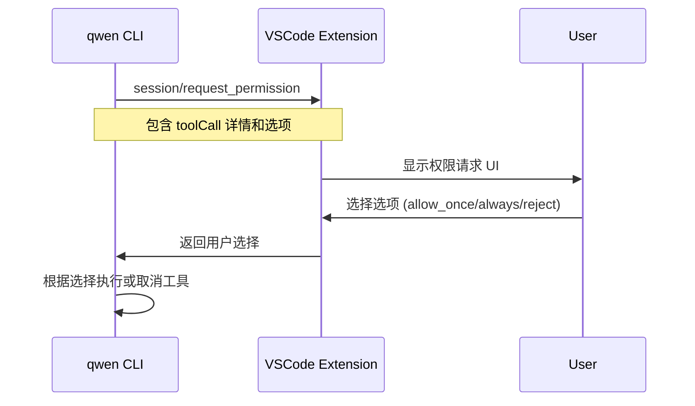

# ACP 协议实现状态对比

## 概述

ACP (Agent Communication Protocol) 是基于 JSON-RPC 2.0 的双向通信协议，用于 IDE 客户端与 AI Agent 服务器之间的通信。

- **协议定义**: Google 开源的标准协议（Apache-2.0 License）
- **协议版本**: 1
- **传输格式**: JSON-RPC 2.0，通过 stdin/stdout 进行行分隔的 JSON 通信

## 架构说明

```
┌─────────────────┐                    ┌──────────────────┐
│  IDE Client     │                    │   Agent Server   │
│  (VSCode 扩展)  │◄──── JSON-RPC ────►│   (qwen CLI)     │
└─────────────────┘                    └──────────────────┘
```

### 角色定义

- **Client (VSCode 扩展)**:
  - 提供 UI 界面
  - 处理文件读写
  - 请求用户权限
  - 接收并展示 Agent 的消息

- **Server (qwen CLI)**:
  - 处理 LLM 交互
  - 执行工具调用
  - 管理会话状态
  - 流式返回响应

## 协议方法对比

### 1. Agent Methods (CLI 实现，VSCode 调用)

这些是 **qwen CLI** 作为 Server 实现的方法，**VSCode 扩展** 作为 Client 调用：

| 方法             | CLI 实现 | VSCode 调用 | 功能描述                  | 文件位置                                                                             |
| ---------------- | -------- | ----------- | ------------------------- | ------------------------------------------------------------------------------------ |
| `initialize`     | ✅       | ✅          | 协议初始化，交换能力信息  | CLI: `zedIntegration.ts:105-136`<br>VSCode: `AcpConnection.ts:439-461`               |
| `authenticate`   | ✅       | ✅          | 用户认证（OAuth/API Key） | CLI: `zedIntegration.ts:138-148`<br>VSCode: `AcpConnection.ts:463-471`               |
| `session/new`    | ✅       | ✅          | 创建新的聊天会话          | CLI: `zedIntegration.ts:150-191`<br>VSCode: `AcpConnection.ts:473-485`               |
| `session/load`   | ❌       | ✅          | 加载历史会话              | CLI: 已定义但禁用（返回 `loadSession: false`）<br>VSCode: `AcpConnection.ts:541-553` |
| `session/prompt` | ✅       | ✅          | 发送用户消息给 Agent      | CLI: `zedIntegration.ts:234-240`<br>VSCode: `AcpConnection.ts:487-496`               |
| `session/cancel` | ✅       | ❌          | 取消当前生成              | CLI: `zedIntegration.ts:226-232`<br>VSCode: **未实现**                               |

**自定义扩展方法（非标准 ACP）:**

| 方法             | CLI 实现 | VSCode 调用 | 功能描述       | 文件位置                           |
| ---------------- | -------- | ----------- | -------------- | ---------------------------------- |
| `session/list`   | ❌       | ✅          | 列出所有会话   | VSCode: `AcpConnection.ts:498-511` |
| `session/switch` | ❌       | ✅          | 切换到指定会话 | VSCode: `AcpConnection.ts:513-521` |

### 2. Client Methods (VSCode 实现，CLI 调用)

这些是 **VSCode 扩展** 作为 Client 实现的方法，**qwen CLI** 作为 Server 调用：

| 方法                         | VSCode 实现 | CLI 调用 | 功能描述                         | 文件位置                                                                 |
| ---------------------------- | ----------- | -------- | -------------------------------- | ------------------------------------------------------------------------ |
| `session/update`             | ✅          | ✅       | 流式发送会话更新（notification） | CLI: `acp.ts:69-74`<br>VSCode: `AcpConnection.ts:280-283` (via callback) |
| `session/request_permission` | ✅          | ✅       | 请求用户授权工具执行             | CLI: `acp.ts:82-89`<br>VSCode: `AcpConnection.ts:330-359`                |
| `fs/read_text_file`          | ✅          | ✅       | 读取文件内容                     | CLI: `acp.ts:91-98`<br>VSCode: `AcpConnection.ts:361-403`                |
| `fs/write_text_file`         | ✅          | ✅       | 写入文件内容                     | CLI: `acp.ts:100-107`<br>VSCode: `AcpConnection.ts:405-436`              |

## Session Update 类型对比

`session/update` 是一个 notification（不需要响应），支持多种更新类型：

| 更新类型              | CLI 发送 | VSCode 处理 | 功能描述             | 实现位置                                                            |
| --------------------- | -------- | ----------- | -------------------- | ------------------------------------------------------------------- |
| `user_message_chunk`  | ✅       | ✅          | 用户消息片段         | CLI: `zedIntegration.ts:N/A` (echo back)<br>VSCode: Webview 渲染    |
| `agent_message_chunk` | ✅       | ✅          | Agent 回复片段       | CLI: `zedIntegration.ts:310-322`<br>VSCode: Webview 渲染            |
| `agent_thought_chunk` | ✅       | ⚠️          | Agent 思考过程       | CLI: `zedIntegration.ts:318` (thought=true)<br>VSCode: 需要特殊样式 |
| `tool_call`           | ✅       | ✅          | 工具调用开始         | CLI: `zedIntegration.ts:500-509`<br>VSCode: 显示 ToolCall 组件      |
| `tool_call_update`    | ✅       | ✅          | 工具调用完成/失败    | CLI: `zedIntegration.ts:560-566`<br>VSCode: 更新 ToolCall 状态      |
| `plan`                | ✅       | ⚠️          | 任务计划（TodoList） | CLI: `zedIntegration.ts:547-552`<br>VSCode: 需要实现 Plan UI        |

## 功能缺失对比

### VSCode 扩展缺失的功能

| 功能                       | 影响                       | 建议优先级 |
| -------------------------- | -------------------------- | ---------- |
| `session/cancel` 方法      | 用户无法取消正在运行的请求 | 🔴 高      |
| `agent_thought_chunk` 展示 | 看不到 Agent 的思考过程    | 🟡 中      |
| `plan` 类型展示            | 看不到 Agent 的任务计划    | 🟡 中      |
| Audio/Image content blocks | 不支持多模态输入           | 🟢 低      |
| Embedded resources         | 不支持嵌入式资源           | 🟢 低      |
| `session/load`             | CLI 本身不支持，优先级低   | 🟢 低      |

### CLI 缺失的功能

| 功能             | 影响                     | 建议优先级 |
| ---------------- | ------------------------ | ---------- |
| `session/load`   | 无法恢复历史会话         | 🟡 中      |
| `session/list`   | 需要 VSCode 扩展自己管理 | 🟢 低      |
| `session/switch` | 需要 VSCode 扩展自己管理 | 🟢 低      |

## 能力声明对比

### CLI Agent Capabilities

```typescript
{
  protocolVersion: 1,
  authMethods: [
    { id: 'use_openai', name: 'Use OpenAI API key' },
    { id: 'qwen_oauth', name: 'Qwen OAuth' }
  ],
  agentCapabilities: {
    loadSession: false,           // ❌ 不支持加载历史会话
    promptCapabilities: {
      image: true,                // ✅ 支持图片输入
      audio: true,                // ✅ 支持音频输入
      embeddedContext: true       // ✅ 支持嵌入式上下文
    }
  }
}
```

### VSCode Client Capabilities

```typescript
{
  protocolVersion: 1,
  clientCapabilities: {
    fs: {
      readTextFile: true,         // ✅ 支持读文件
      writeTextFile: true         // ✅ 支持写文件
    }
  }
}
```

## 工具类型 (Tool Kinds)

所有工具调用都有一个 `kind` 字段，用于分类：

| Kind      | 描述     | 示例                      |
| --------- | -------- | ------------------------- |
| `read`    | 读取操作 | Read, ReadManyFiles, Glob |
| `edit`    | 编辑操作 | Edit, Write               |
| `delete`  | 删除操作 | Delete files/directories  |
| `move`    | 移动操作 | Move/rename files         |
| `search`  | 搜索操作 | Grep, Search              |
| `execute` | 执行操作 | Bash, RunCommand          |
| `think`   | 思考操作 | Task (sub-agent)          |
| `fetch`   | 网络请求 | WebFetch, API calls       |
| `other`   | 其他操作 | TodoWrite, etc.           |

## 权���确认流程



权限选项类型：

- `allow_once`: 仅允许一次
- `allow_always`: 始终允许（针对文件/命令/服务器）
- `reject_once`: 拒绝一次
- `reject_always`: 始终拒绝

## Schema ���证

### 如何使用 Schema

VSCode 扩展现在有完整的 Zod schema 定义：

```typescript
import * as schema from './acp/schema.js';

// 验证请求
const params: schema.InitializeRequest = {
  protocolVersion: schema.PROTOCOL_VERSION,
  clientCapabilities: { ... }
};

// 运行时验证
schema.initializeRequestSchema.parse(params);
```

### 验证的好处

1. **类型安全**: TypeScript 编译时检查
2. **运行时验证**: 捕获协议不匹配错误
3. **文档化**: Schema 即文档
4. **一目了然**: 清楚知道哪些字段是必需的

## 下一步建议

### 高优先级

1. **实现 `session/cancel`**: 允许用户取消正在运行的请求
   - 在 `AcpConnection` 中实现 `cancel()` 方法
   - 在 Webview UI 添加取消按钮

2. **实现 `agent_thought_chunk` 展示**: 显示 Agent 的思考过程
   - 在 Webview 中添加 "思考中..." 样式
   - 可折叠显示详细思考内容

### 中优先级

3. **实现 `plan` 类型展示**: 显示任务计划列表
   - 设计 Todo/Plan 组件
   - 实时更新任务状态

4. **添加 Schema 验证**: 在更多关键位置添加运行时验证
   - `session/new` 参数验证
   - `session/prompt` 参数验证
   - 所有 `session/update` 类型验证

### 低优先级

5. **支持多模态内容**: 图片、音频输入
6. **支持嵌入式资源**: Resource blocks
7. **实现 `session/load`**: 需要先等 CLI 支持

## 参考资源

- **Schema 定义**: `packages/vscode-ide-companion/src/acp/schema.ts`
- **CLI 实现**: `packages/cli/src/zed-integration/`
- **VSCode 实现**: `packages/vscode-ide-companion/src/acp/AcpConnection.ts`
- **协议来源**: Google (Apache-2.0 License)
